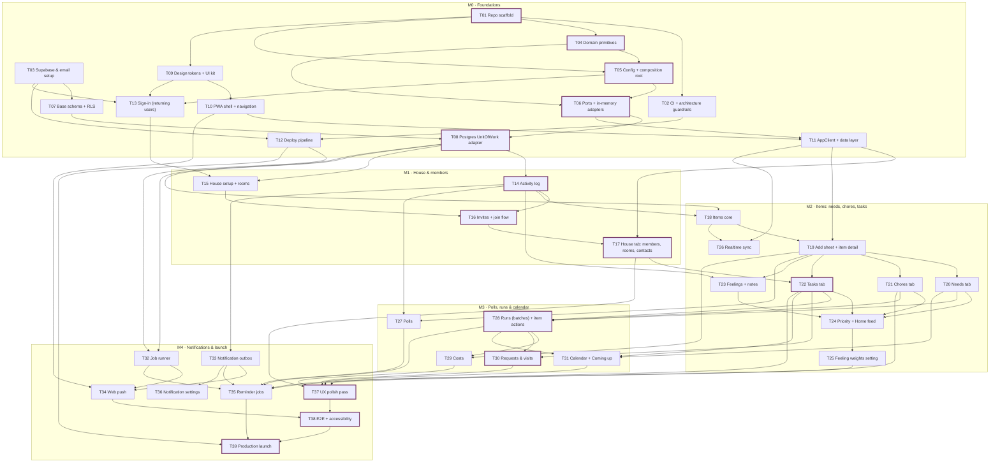

# Roomies — Implementation Plan

**Status:** Draft v0.1  
**Built from:** [PRD.md](./PRD.md) · [ARCHITECTURE.md](./ARCHITECTURE.md) · [FRONTEND.md](./FRONTEND.md) · [mockup.html](./mockup.html)  
**Last updated:** 2026-09-25

> **Generated file.** The task list lives in [`scripts/generate_plan.py`](../scripts/generate_plan.py), so the tables, the dependency graph, and the critical path always agree. To change a task, edit the list there and run `python3 scripts/generate_plan.py docs/IMPLEMENTATION_PLAN.md`. The script fails if a dependency is unknown or points forward.

---

## 1. How the work is divided

- **Milestones follow the PRD release plan** (§12, v1 scope). Everything in PRD §13 (bills, belongings, rotations, outside-help stages, heads-ups, info, email) is out of this plan.
- **Each task is a vertical slice** (migration → domain types + pure functions → use case → adapter → UI → tests), so it can be demoed and merged on its own. The exceptions are the M0 plumbing tasks, which have nothing to show on screen.
- **Tasks are sized** S ≈ half a day, M ≈ 1–2 days, L ≈ 3 days, for one person. The estimates are only used to find the critical path.
- **Dependencies are hard dependencies only**: a task can't start until the tasks it depends on are merged. Everything else can happen in any order.

### Definition of done (every task)

1. The migration (if any) has RLS on every new table, plus an RLS test.
2. Domain functions are pure, with unit tests. Use cases are tested against the in-memory adapters with a fixed clock.
3. New ports or adapters pass the shared contract tests on both memory and Postgres.
4. Lint boundaries pass. No `process.env`, `new Date()`, or Supabase imports outside the allowed layers.
5. It's deployed to a preview, checked at 375pt in light and dark, and uses the copy voice from FRONTEND §7.

---

## 2. Summary

- **39 tasks** across **5 milestones**, about **53 working days** in total for one person.
- **Critical path** (longest chain of dependencies, about **21.5 days**): T01 → T04 → T05 → T06 → T08 → T14 → T16 → T17 → T22 → T28 → T30 → T37 → T38 → T39.
- Everything off the critical path can fill gaps, e.g. while waiting on a review or on a roommate to test.

| Milestone | Tasks | Est. days | Exit criteria |
|---|---|---|---|
| **M0 · Foundations** | T01–T13 (13) | 15.5 | The owner signs in on an iPhone and sees the empty app shell. A stranger's email gets no code. |
| **M1 · House & members** | T14–T17 (4) | 7.5 | The house exists with its rooms and contacts, and all roommates have joined through invite links. |
| **M2 · Items: needs, chores, tasks** | T18–T26 (9) | 10.5 | The house uses the needs list and chores for a week, and feelings re-rank the Home feed. |
| **M3 · Polls, runs & calendar** | T27–T31 (5) | 10.5 | One grocery run (with a cost), one poll, and one super visit are completed. Dated things show on the calendar. |
| **M4 · Notifications & launch** | T32–T39 (8) | 9 | Everyone gets reminders on their phone, and the house runs on production. |

---

## 3. Dependency graph

Arrows point from a task to the tasks it unblocks. Critical-path tasks are outlined in plum. It renders on GitHub.

---

## 4. Tasks

### M0 · Foundations

**Exit:** The owner signs in on an iPhone and sees the empty app shell. A stranger's email gets no code.

| ID | Task | Size | Depends on | Unblocks |
|---|---|---|---|---|
| T01 ⭑ | **Repo scaffold** | M | — | T02, T04, T05, T09 |
| T02 | **CI + architecture guardrails** | S | T01 | T12 |
| T03 | **Supabase & email setup** | M | — | T07, T12, T13 |
| T04 ⭑ | **Domain primitives** | S | T01 | T05, T06 |
| T05 ⭑ | **Config + composition root** | S | T01, T04 | T06, T13 |
| T06 ⭑ | **Ports + in-memory adapters** | M | T04, T05 | T08, T11 |
| T07 | **Base schema + RLS** | M | T03 | T08 |
| T08 ⭑ | **Postgres UnitOfWork adapter** | M | T06, T07 | T14, T15, T18, T32 |
| T09 | **Design tokens + UI kit** | M | T01 | T10, T13 |
| T10 | **PWA shell + navigation** | M | T09 | T11, T34 |
| T11 | **AppClient + data layer** | M | T06, T10 | T17, T19, T26 |
| T12 | **Deploy pipeline** | S | T02, T03 | T32, T39 |
| T13 | **Sign-in (returning users)** | M | T03, T05, T09 | T15 |

- **T01 Repo scaffold**: Next.js (App Router) + strict TypeScript + Tailwind v4 + Vitest + ESLint/Prettier, with the folder layout from Architecture §8 (`lib/domain`, `lib/app`, `lib/adapters`, `lib/client`, `compose.ts`, `config.ts`).  
  *Done when:* `pnpm dev`, `pnpm test`, and `pnpm lint` all pass on an empty app.
- **T02 CI + architecture guardrails**: A GitHub Actions workflow runs typecheck, lint, and tests. `eslint-plugin-boundaries` enforces the layer rules: domain imports nothing, app imports only domain + ports, and only adapters/compose touch Supabase or Kysely.  
  *Done when:* A PR that imports Supabase from `lib/domain` fails CI.
- **T03 Supabase & email setup**: Local Supabase via the CLI, plus staging and prod projects. Auth: public sign-up off, 6-digit email code with a 10-min expiry, code-only template. A dedicated house Gmail (2-step verification, app password) as custom SMTP.  
  *Done when:* A code email arrives from staging for an existing user, and an unknown email gets nothing.
- **T04 Domain primitives**: Branded ids, `Instant`, `When`/`LocalDate`, `Cents`, `Result`, `Actor`, plus time-zone and money helpers, with unit tests (including DST).  
  *Done when:* The primitives are covered by tests, and no `Date.now()` appears in `lib/domain`.
- **T05 Config + composition root**: `loadConfig(env)` validated by Zod (the only reader of `process.env`) and `compose.ts` with `depsForRequest` / `depsForJob` / `depsForTest` stubs.  
  *Done when:* A missing env var fails at startup with a clear message.
- **T06 Ports + in-memory adapters**: `ports.ts` (UnitOfWork, Repos, EventSink, Clock, IdGenerator, HouseQueries, ChangeFeed, AuthGateway, Config) plus memory fakes, a fixed clock, sequential ids, and a reusable contract-test harness.  
  *Done when:* A sample use case runs end to end against the memory adapters in a test.
- **T07 Base schema + RLS**: Migrations for houses (with settings), members, rooms, invites, profiles, contacts, `activity_events` (typed subject columns, per-kind CHECKs, indexes, no UPDATE/DELETE grant), and notifications_outbox. `is_member` / `is_admin`, RLS on every table, a CI check that fails if any table lacks RLS, and a sizing script (`pg_column_size` / `pg_total_relation_size` on sample events).  
  *Done when:* RLS tests show a non-member reads nothing and a member reads only their house. An UPDATE on activity_events is refused, and the sizing script prints real bytes per event kind.
- **T08 Postgres UnitOfWork adapter**: Kysely over the Supavisor transaction pooler with an `app_server` role. Each transaction runs `set local role authenticated` + the user's JWT claims. Includes the EventSink writer.  
  *Done when:* The same contract tests pass against memory and Postgres, and `auth.uid()` inside a transaction equals the actor.
- **T09 Design tokens + UI kit**: Light/dark CSS tokens (base, elements, plum, tiers) and core components: Card, Button, Chip, Avatar, Sheet (Vaul), TabBar, ListRow, SegmentedControl, Toast, EmptyState.  
  *Done when:* A `/dev/kit` page shows every component in light and dark at 375pt, passing a contrast check.
- **T10 PWA shell + navigation**: Manifest, icons, a service worker that caches the app shell, safe areas, the 5-tab layout (Home, Needs, Chores, Tasks, House) with empty screens, and the Add-to-Home-Screen guide.  
  *Done when:* It installs to the iPhone Home Screen and opens standalone with the tab bar above the home indicator.
- **T11 AppClient + data layer**: The `AppClient` interface + React context, TanStack Query setup, the Supabase browser adapter for `HouseQueries`, and a server-action helper that validates input and maps `Result`.  
  *Done when:* One screen reads through `useX()` hooks and renders with a fake AppClient in a component test.
- **T12 Deploy pipeline**: The Vercel project in the same region as Supabase, env vars per environment, preview deploys against staging, migrations applied on merge, and Sentry.  
  *Done when:* Merging to main deploys staging automatically with migrations applied.
- **T13 Sign-in (returning users)**: An AuthGateway adapter (Supabase), `/sign-in` → 6-digit code screen with one-time-code autofill, session middleware, and sign out. The same message shows whether or not the email exists.  
  *Done when:* An existing user signs in on iPhone. An unknown email sees the neutral message and gets no code.

### M1 · House & members

**Exit:** The house exists with its rooms and contacts, and all roommates have joined through invite links.

| ID | Task | Size | Depends on | Unblocks |
|---|---|---|---|---|
| T14 ⭑ | **Activity log** | M | T08 | T16, T18, T23, T27, T33 |
| T15 | **House setup + rooms** | M | T08, T13 | T16 |
| T16 ⭑ | **Invites + join flow** | L | T14, T15 | T17 |
| T17 ⭑ | **House tab: members, rooms, contacts** | M | T11, T16 | T22, T37 |

- **T14 Activity log**: The `DomainEvent` union (catalog in Architecture §6.4), pure `activityRowFor` and `activityLine` (grouping by `action_id`), EventSink wiring, and the Activity screen with keyset pagination.  
  *Done when:* Any use case that returns events produces activity rows in the same transaction (rollback test included), and a 3-task bulk move shows as one feed line.
- **T15 House setup + rooms**: The `setupHouse` use case + `/setup/[token]`, seeding the apartment's rooms (Air, Fire, Water, Earth, Bathrooms 1–3, Fitness space, …) and default feeling weights, with the owner as admin. Blocked once a house exists.  
  *Done when:* The owner creates the house once, and a second attempt is rejected.
- **T16 Invites + join flow**: Pure `validateInvite`, `startInvite` / `acceptInvite` use cases, admin create/revoke/expiry/use-limit UI, `/join/[token]` (name + email → code → "Which room is yours?"), and per-IP rate limits.  
  *Done when:* A roommate joins from a link. Expired, revoked, and used-up links are rejected, and everyone gets a `member.joined` entry.
- **T17 House tab: members, rooms, contacts**: Element-colored avatars, the roommates list, rooms grouped by floor (rename, reorder), contacts CRUD with Copy number, remove member / moved out, and delete my account.  
  *Done when:* The super and landlord are saved. Removing a member revokes access (RLS test).

### M2 · Items: needs, chores, tasks

**Exit:** The house uses the needs list and chores for a week, and feelings re-rank the Home feed.

| ID | Task | Size | Depends on | Unblocks |
|---|---|---|---|---|
| T18 | **Items core** | M | T08, T14 | T19, T26 |
| T19 | **Add sheet + item detail** | M | T11, T18 | T20, T21, T22, T23, T27, T29 |
| T20 | **Needs tab** | M | T19 | T24, T28, T31 |
| T21 | **Chores tab** | M | T19 | T24, T28, T35 |
| T22 ⭑ | **Tasks tab** | S | T19, T17 | T24, T28, T30, T31, T35 |
| T23 | **Feelings + notes** | M | T19, T14 | T24 |
| T24 | **Priority + Home feed** | M | T20, T21, T22, T23 | T25 |
| T25 | **Feeling weights setting** | S | T24 | T37 |
| T26 | **Realtime sync** | S | T11, T18 | — |

- **T18 Items core**: The `items` migration with its CHECKs, the `Need | Chore | Task` domain union, pure `createItem` (duplicate-need check) / `editItem` / `markDone` / `doChore`, the items repo with `toDomain`/`toRow`, and the use cases.  
  *Done when:* Each category's rules hold in both the domain and the database (a chore can't be done, a need can't repeat), tested on both adapters.
- **T19 Add sheet + item detail**: The "+" picker (Need / Chore / Task / Poll / Run, with poll and run disabled until M3), title-first forms per category, the room picker, and the item detail sheet shell.  
  *Done when:* Any item can be added with just a title in 3 taps and opened in the detail sheet.
- **T20 Needs tab**: The shared list (needs with a feeling first), Got it (with undo), feeling emoji on rows, and "We need…" add that points to an existing duplicate. No Soon flag.  
  *Done when:* Adding "tomatoes" twice points to the first. Got it removes it with undo.
- **T21 Chores tab**: As-needed and about-every-N-days chores, "last done" meta, sorting by overdue, and one-tap Did it.  
  *Done when:* An every-7-days chore last done 9 days ago sorts to the top, and Did it resets it.
- **T22 Tasks tab**: Tasks with a date, assignee, and **Handled by** (a contact, with Copy number), settable at creation or later from the detail ("Needs outside help?" / Change, including adding a new contact inline), plus the Mine / All / Outside help filters.  
  *Done when:* An existing task can be handed to the super later and shows under Outside help with the super's number.
- **T23 Feelings + notes**: The `feelings` table, pure `setFeeling` (the event carries the previous one), the feeling sheet, "How the house feels", and the Earlier list from activity.  
  *Done when:* Changing a feeling moves the old one into Earlier.
- **T24 Priority + Home feed**: Pure `scorePriority` + `isInFeed` (weights and `now` injected), the Needs attention feed with Mine / All, tier chips, and "Why is this here?"  
  *Done when:* A table of test cases matches PRD §8.1, and an as-needed chore appears only after someone shares a feeling.
- **T25 Feeling weights setting**: House → Settings → Feeling weights: steppers from −20 to +40, Reset to defaults, the `setFeelingWeights` use case (any member), and the Home card announcing the change.  
  *Done when:* Setting 😰 to +40 re-ranks the feed for every member, and a non-admin can do it.
- **T26 Realtime sync**: A `ChangeFeed` adapter (Supabase Realtime) filtered by house that invalidates the matching queries.  
  *Done when:* A change on one phone appears on another within a couple of seconds.

### M3 · Polls, runs & calendar

**Exit:** One grocery run (with a cost), one poll, and one super visit are completed. Dated things show on the calendar.

| ID | Task | Size | Depends on | Unblocks |
|---|---|---|---|---|
| T27 | **Polls** | M | T19, T14 | T35 |
| T28 ⭑ | **Runs (batches) + item actions** | L | T20, T21, T22 | T29, T30, T31, T35 |
| T29 | **Costs** | M | T19, T28 | T37 |
| T30 ⭑ | **Requests & visits** | L | T28, T22 | T37 |
| T31 | **Calendar + Coming up** | M | T20, T22, T28 | T37 |

- **T27 Polls**: `polls`, `poll_options`, `poll_votes`. Pure `createPoll` / `vote` / `closePoll` (most votes wins, a tie → "Tie"), the poll sheet, `addPollOption` (anyone, while open), "+ Poll about this" on items, standalone polls, and Open polls on Home.  
  *Done when:* "Which vacuum?" on a need and a standalone "House name?" both work, and a 2–2 result shows a tie.
- **T28 Runs (batches) + item actions**: `runs` (kind + per-kind status) and `items.run_id` / `run_kind` (current run, composite foreign key). History comes from `run.item_*` activity events, read back by pure `runHistory` / `itemPath`. Pure `startRun` / `addToRun` / `markRunItemsDone` / `moveRunItems` / `returnToPool` / `finishRun` (effects as data). Start a run from Needs, the run sheet with selection + bulk actions, "On X's run" badges, Runs in progress on Home, and item history.  
  *Done when:* An item can only be on one run. Selected items can be done, moved to another run, or put back with a note, and finishing returns the rest.
- **T29 Costs**: The `costs` table, `addCost`, Add cost on items, "Did you spend money?" on finishing a run, Open Splitwise copy, and Spent this month on House.  
  *Done when:* Finishing a grocery run with $42.50 records one cost on the run and updates Spent this month.
- **T30 Requests & visits**: Request runs (gathering → sent → closed) and visit runs. `addToRequest` ("Add to Landlord list"), `sendRequest` (composed message + copy + mark as sent), `handToContact`, Move to a visit (new or existing, optional date), `setVisitDate`, the **New request or visit** entry point on Tasks (start a request for any contact, or plan a visit), Requests & visits on Tasks, the tasks-only rule, and the feed rule for tasks on a visit.  
  *Done when:* Landlord list → sent → the reply is recorded by moving 2 tasks to a new visit and 1 back to the pool with a note. The request closes itself, and each task's history shows the path.
- **T31 Calendar + Coming up**: The Coming up strip on Home (the next 7 days of dated tasks, needs, and runs) and the month calendar with a day list.  
  *Done when:* Dated items and runs show on the right days, and tapping one opens it.

### M4 · Notifications & launch

**Exit:** Everyone gets reminders on their phone, and the house runs on production.

| ID | Task | Size | Depends on | Unblocks |
|---|---|---|---|---|
| T32 | **Job runner** | S | T08, T12 | T34, T35 |
| T33 | **Notification outbox** | M | T14 | T34, T35, T36 |
| T34 | **Web push** | M | T33, T10, T32 | T38 |
| T35 | **Reminder jobs** | M | T32, T33, T21, T22, T27, T28 | T39 |
| T36 | **Notification settings** | S | T33 | — |
| T37 ⭑ | **UX polish pass** | M | T25, T29, T30, T31, T17 | T38 |
| T38 ⭑ | **E2E + accessibility** | M | T37, T34 | T39 |
| T39 ⭑ | **Production launch** | S | T38, T35, T12 | — |

- **T32 Job runner**: `/api/cron/*` with a secret header, `depsForJob()` (system actor), and a pg_cron + pg_net migration that calls the routes on schedule.  
  *Done when:* A no-op job runs every 15 minutes on staging and logs success.
- **T33 Notification outbox**: Pure `notificationsFor` (per-category prefs, quiet hours in the house timezone), `notification_prefs`, and EventSink writing outbox rows in the same transaction.  
  *Done when:* Table tests cover quiet hours, and a 😰 feeling enqueues a message for the assignee.
- **T34 Web push**: VAPID keys, the enable-notifications flow, the service worker `push` / `notificationclick`, a PushSender adapter (drops 404/410 subscriptions), and `sendNotifications` (right after commit + every 5 min).  
  *Done when:* An installed iPhone receives a push within seconds of being assigned something.
- **T35 Reminder jobs**: `runReminders` (due tasks and chores, polls closing tomorrow, dated runs tomorrow) and `closeDuePolls`, all with an injected clock.  
  *Done when:* Each job has fixed-clock tests and is idempotent when run twice.
- **T36 Notification settings**: Personal settings (under your avatar): per-category toggles, quiet hours, and theme.  
  *Done when:* Turning off a category stops those messages from being enqueued.
- **T37 UX polish pass**: Empty states, a copy pass against the FRONTEND voice table, completion bursts, reduced motion, and dark mode checks.  
  *Done when:* Every screen has an empty state, and no copy uses "overdue," "failed," or "missed" about a person.
- **T38 E2E + accessibility**: Playwright on the iPhone profile: join, add a need, grocery run with a cost, poll with a tie, plan + finish a visit, share a feeling, change a feeling weight. Plus a VoiceOver pass and a contrast check.  
  *Done when:* E2E suite green on the preview URL, with no critical VoiceOver issues.
- **T39 Production launch**: Prod project and env, a weekly `pg_dump` backup workflow, an uptime ping, the setup link for the owner, then invites to roommates.  
  *Done when:* All roommates are on prod and a backup restores into staging.

⭑ = on the critical path.

---

## 5. Suggested order for one person

A valid order that follows every dependency, front-loads the critical path, and gets something usable to the house early:

M0. T01 → T04 → T05 → T06 → T02 → T03 → T07 → T08 → T09 → T10 → T11 → T12 → T13
M1. T14 → T15 → T16 → T17
M2. T18 → T19 → T22 → T20 → T21 → T23 → T24 → T25 → T26
M3. T28 → T30 → T27 → T29 → T31
M4. T37 → T32 → T33 → T34 → T38 → T35 → T39 → T36

**Early-feedback checkpoints**
- **After T20:** the needs list works. That's the first thing worth handing to roommates, even before chores and the feed.
- **After T28–T29:** grocery runs with costs work, which is the first real weekly use.
- **After M2:** if people forget to open the app, pull **T32–T34** (push) ahead of M3. They only depend on M0 tasks plus T14.

---

## 6. Parallel tracks

For a second contributor (or to interleave work), these groups have no dependencies on each other once their inputs are done:

| Track | Tasks | Needs first |
|---|---|---|
| UI kit & shell | T09, T10 | T01 |
| Infra & deploy | T03, T07, T12 | — |
| Needs / chores / tasks tabs | T20, T21, T22 | T19 (T22 also T17) |
| Polls | T27 | T19, T14 |
| Notifications | T33, T36, then T34 | T14 (T34 also T32, T10) |

---

## 7. Out of scope (later)

Everything in PRD §13: bills, belongings & ownership, rotating chores, outside-help stages, standalone heads-ups, info items, +1s, full priority presets, tags/attachments/links, email digest, passkeys, Splitwise API, multiple houses. None of these block v1, and none are in the graph.
